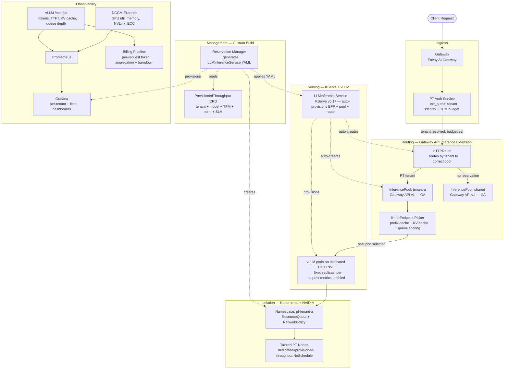

# Provisioned Throughput — Product, Experience, and Architecture

**Date:** 2026-09-03 | **From:** PM — Inference Platform | **For:** Engineering Leadership

---

## Page 1 — The Product

Provisioned Throughput (PT) reserves a fixed tokens-per-minute capacity for a specific model on dedicated GPU nodes, backed by a TTFT SLA. The customer commits to a throughput level and a term. The platform guarantees that capacity is always warm, physically isolated from shared serving traffic, and available up to the committed limit. Traffic that exceeds the reservation spills to the shared pool.

### Shared Serving vs. Provisioned Throughput

| Dimension | Shared Serving (today) | Provisioned Throughput |
|---|---|---|
| Isolation | None. All teams share the same GPU pool. | Phase 1: dedicated GPU nodes per reservation, physically isolated via node taints. Phase 2: evaluates logical isolation (scheduling priority via InferenceObjective) for better fleet utilisation. |
| TTFT guarantee | Best-effort. Spikes to 4s+ under contention. | SLA-bound. Latency target attainment: 99% of requests within committed TPM meet the published TTFT target for the model and tier (e.g., 500ms). |
| Capacity | Variable. Depends on cluster load. | Fixed. Reserved TPM always available up to committed level. |
| Routing | Round-robin across replicas. | Intelligent. llm-d EPP routes to the pod with warmest KV cache, lowest queue. |
| Cost model | Per-team chargeback on usage (if tracked). | Flat committed rate per TPM-hour. Spillover billed separately. |
| SLA | None. | 99.5% availability. 99% latency target attainment. SLA credits on breach. |

### What a Customer Gets

| Feature | How It Works |
|---|---|
| Guaranteed TPM with latency target attainment SLA | Dedicated vLLM replicas with `minReplicas == maxReplicas`. Always warm. 99% of requests within committed TPM meet the published TTFT target. |
| GPU isolation | Phase 1: physical — PT nodes tainted `dedicated=provisioned-throughput:NoSchedule`. Phase 2: evaluates logical isolation via InferenceObjective priority for better fleet utilisation. Note: Google Vertex AI uses logical isolation (scheduling priority, not hardware exclusivity). |
| Cache-aware intelligent routing | llm-d EPP scores each pod by prefix cache locality, KV cache occupancy, queue depth. |
| Spillover to shared pool | Overflow routes to the shared pool. No hard 429 unless the customer opts in. |
| Per-request routing control | `X-PT-Request-Type: dedicated` (PT only) or `shared` (bypass PT for dev/test). |
| Per-tenant dashboard | Grafana auto-provisioned: committed vs consumed TPM, P95 TTFT, GPU utilisation. |
| Burndown rates | Output tokens at 4x input (decode is memory-bound). Cached tokens at 0.25x. |
| Sizing calculator | Input: model, RPM, avg tokens. Output: PT tier, GPU count, cost estimate. |

### Scope Options

| Option | Scope | Effort |
|---|---|---|
| **A** | Internal capacity reservation. Dedicated nodes, chargeback, no formal SLA. | 4-6 weeks |
| **B** | Internal PT product. SLA, spillover, dashboards, sizing calculator, reservation manager. | 3-4 months |
| **C** | Full PT with billing. Burndown rates, SLA credits, contract terms, billing pipeline. | 6-9 months |

---

## Page 2 — The Experience

PT has two personas. The product must be designed for both.

### Consumer Journey (the team using a PT reservation)

```mermaid
graph LR
  subgraph discover [1. Discover]
    Catalog["PT Catalog
    eligible models, tiers, throughput profiles"]
  end

  subgraph size [2. Size]
    Calc["Sizing Calculator
    model + RPM + tokens = tier + cost"]
  end

  subgraph request [3. Request]
    CRD_Apply["Submit reservation
    kubectl apply / platform portal"]
  end

  subgraph provision [4. Provision]
    Status["Pending - Provisioning - Active
    KServe provisions serving stack"]
  end

  subgraph onboard [5. Onboard]
    Endpoint["Receive endpoint URL
    OpenAI-compatible API, same SDK"]
  end

  subgraph use_it [6. Use]
    Infer["Send requests
    auto-routes to PT pool, spillover on overflow"]
  end

  subgraph monitor [7. Monitor]
    Dash["Grafana dashboard
    committed vs consumed, TTFT, GPU, spillover"]
  end

  subgraph manage [8. Manage]
    Ops["Increase TPM, view SLA status
    alerts on capacity, term expiry"]
  end

  Catalog --> Calc --> CRD_Apply --> Status --> Endpoint --> Infer --> Dash --> Ops
```

**Key design principle from Vertex PT:** after onboarding, the consumer sends requests to the same OpenAI-compatible API they already use. No SDK change. No new protocol. The only difference is the endpoint URL points to their PT reservation. Optional headers (`X-PT-Request-Type`) give per-request control over dedicated vs shared routing.

**What the consumer sees at each step:**

| Step | What Happens | What They See |
|---|---|---|
| Discover | Browse PT catalog | Available models, GPU tiers, throughput per tier, price per TPM-hour |
| Size | Run sizing calculator | "For llama3-70b at 500 RPM with 2k avg tokens, you need Performance tier, 16 GPUs, ~$X/month" |
| Request | Submit reservation | CRD status: Pending |
| Provision | Reservation Manager creates namespace + applies LLMInferenceService YAML. KServe provisions vLLM, EPP, routing. | CRD status: Provisioning → Active. Endpoint URL appears in status. |
| Onboard | Point application at endpoint | Same `POST /v1/chat/completions` API. Same SDK. Just a different base URL. |
| Use | Send inference requests | Requests route to dedicated PT pods. Response includes per-request metrics (tokens, timing). |
| Monitor | Open Grafana dashboard | Committed TPM vs consumed. P95 TTFT vs SLA. KV cache utilisation. Spillover count. |
| Manage | Increase TPM, check SLA, get alerts | Alert: "utilisation at 85% — consider increasing TPM." Alert: "term expires in 30 days." |

### Producer Journey (the platform team managing PT)

| Step | What Happens | Tooling |
|---|---|---|
| Catalog a model | Run benchmarks. Create throughput profile. Set per-tier pricing. | Benchmark scripts + throughput profile registry |
| Capacity plan | View fleet GPU capacity vs committed reservations. Alert at 85%. | Fleet dashboard (Grafana) + PT Capacity Planner |
| Approve reservation | Review request. Verify GPU capacity. Approve CRD creation. | kubectl / approval workflow |
| Provision | Reservation Manager applies LLMInferenceService YAML. KServe and GPU Operator handle the rest. | Automated via KServe |
| Monitor fleet | All-reservations dashboard: utilisation, SLA compliance, node health per tenant. | Fleet Grafana dashboard + DCGM alerts |
| Operate | Node failure → N+1 spare failover. Driver updates. Maintenance windows. | PT Health Monitor + operational runbooks |
| Right-size | Identify under-utilised reservations. Advise tenants on downsizing at renewal. | Utilisation reports |
| Renew / terminate | Process term expirations. Handle auto-renewals. Archive billing records. | CronJob + Reservation Manager |

---

## Page 3 — The Architecture

### Component Map

| Component | Upstream Project | Status | PT Role |
|---|---|---|---|
| LLMInferenceService | KServe v0.17 | Production | Deploys vLLM + auto-provisions EPP, InferencePool, HTTPRoute |
| vLLM | vllm-project/vllm V1 | Production | LLM serving engine. Per-request metrics for billing. |
| llm-d EPP | llm-d/llm-d-router | Production | Picks the optimal vLLM pod per request (cache, queue, load) |
| InferencePool | Gateway API Inference Extension | GA (v1) | Groups vLLM pods into a routing target per tenant |
| InferenceObjective | Gateway API Inference Extension | Alpha (v1alpha2) | Priority scheduling: PT priority=1, shared priority=2 |
| Gateway | Envoy AI Gateway | Production (v1.1) | Token counting, rate limiting, ext_authz integration |
| DCGM Exporter | NVIDIA DCGM | Production | GPU metrics: utilisation, memory, temperature, ECC |
| Kueue | kubernetes-sigs/kueue | GA | Batch PT workloads (scheduled jobs, not real-time) |
| MIG | NVIDIA GPU Operator | Production | Sub-GPU PT tiers on A100 (Phase 3) |
| NVIDIA GPU Operator | NVIDIA | Production | GPU drivers, device plugin, node labeling, MIG Manager, DCGM deployment |
| Kueue | kubernetes-sigs/kueue | GA | Per-team GPU quotas via ClusterQueue + ResourceFlavor. Fair-sharing via cohorts. |
| **Reservation Manager** | **Custom build** | **Phase 1** | **Tracks reservations. Generates LLMInferenceService YAML. Does NOT manage GPUs or routing.** |
| **PT Auth Service** | **Custom build** | **Phase 1** | **Tenant identity, TPM budget, request-type routing** |
| **Sizing Calculator** | **Custom build** | **Phase 1** | **Workload inputs to PT tier recommendation** |
| **PT Catalog** | **Custom build** | **Phase 1** | **Model registry with throughput profiles and pricing** |
| **Chargeback Pipeline** | **Custom build** | **Phase 2** | **Per-request token aggregation with burndown rates, monthly chargeback report per cost centre, SLA credit deductions** |
| **Consumer Dashboard** | **Custom build** | **Phase 1** | **Per-tenant Grafana: utilisation, TTFT, SLA, spillover** |
| **Fleet Dashboard** | **Custom build** | **Phase 1** | **Producer view: all reservations, capacity, health** |

### Build Gap

The upstream stack (KServe, llm-d, vLLM, NVIDIA GPU Operator, Kueue, Gateway API, DCGM) provides all infrastructure: GPU management, model serving, intelligent routing, quota enforcement, and metrics. What does not exist upstream is the business layer: the **Reservation Manager** (who gets how much, for how long), **Auth Service** (tenant routing), **Sizing Calculator**, **Billing Pipeline**, and **dashboard templates**. These are the custom build — thin product logic on top of upstream infrastructure.
