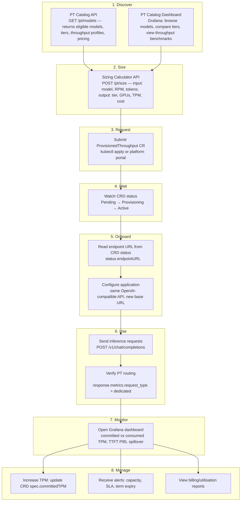

# PT Experience Design: Consumer and Producer Journeys

**Status:** Discovery
**Date:** 2026-09-03
**Owner:** PM — Inference Platform

> This document defines how PT is consumed and operated — the user experience for both the consumer (team using a PT reservation) and the producer (platform team managing the PT fleet). The architecture documents (`10-architecture.md`, `11-pt-crd-spec.md`) define what the system does. This document defines what people see and do when they interact with it.

---

## Design Principle

Vertex AI PT sets the market expectation for how a PT product should be consumed:

1. **Discover** what is available (models, tiers, pricing)
2. **Size** the reservation using a calculator
3. **Purchase** with a commitment
4. **Use** with no code change — same API, different capacity class
5. **Monitor** with a prebuilt dashboard
6. **Manage** through a self-service interface

Our on-prem PT must match this experience quality while adapting it to a Kubernetes-native, air-gapped environment where the "console" is `kubectl`, Grafana, and the platform team's operational tooling.

---

## 1. Consumer Persona

**Who:** An engineering team that runs production LLM inference and needs guaranteed throughput. They may be an ML engineer, a platform engineer, or an application developer who calls inference APIs.

**What they care about:** Will my TTFT stay under 500ms? Can I budget for this? Do I need to change my code?

### 1.1 Consumer Journey



### 1.2 Consumer Experience Detail

**Step 1: Discover**

The consumer needs to know what PT tiers are available before they can size a reservation. The PT Catalog is a registry of PT-eligible models with their throughput profiles.

| What the consumer sees | Where it lives | Data source |
|---|---|---|
| List of PT-eligible models (e.g., llama3-70b, mistral-7b) | PT Catalog API or Grafana dashboard | Model throughput profile registry |
| Per-model throughput profiles: tokens/sec per GPU tier, P95 TTFT at 70% utilisation | Same | Engineering benchmark results |
| PT tiers: Performance (H100 NVL), Max (H200 NVL), Standard (A100), Medium/Small/Micro (MIG) | Same | Fleet GPU inventory + tier definitions |
| Pricing: cost per TPM-hour per tier | Same | FinOps model |

Implementation: a ConfigMap or CRD (`PTModelProfile`) that stores per-model throughput data. Exposed via a lightweight API or directly in Grafana.

**Step 2: Size**

The consumer inputs their workload parameters and gets a PT tier recommendation.

| Input | Example |
|---|---|
| Model | llama3-70b |
| Peak requests per minute (RPM) | 500 |
| Average input tokens per request | 2,000 |
| Average output tokens per request | 500 |
| TTFT SLA requirement | 500ms |

| Output | Example |
|---|---|
| Recommended PT tier | Performance (8x H100 NVL) |
| GPU count | 16 (2 replicas x 8 GPUs) |
| Committed TPM | 120,000 |
| Estimated monthly cost | Contact platform team (or: $X/month if pricing is published) |

Implementation: a CLI tool or API endpoint. Reads from the model throughput profile registry. Applies burndown rate multipliers (output = 4x, cached = 0.25x) to compute weighted TPM.

**Step 3: Request**

The consumer submits a `ProvisionedThroughput` CR. In environments with a platform portal, this could be a web form that generates the CR.

```yaml
apiVersion: pt.platform/v1alpha1
kind: ProvisionedThroughput
metadata:
  name: res-myteam-llama3-70b
spec:
  tenant: myteam
  model: llama3-70b
  gpuType: h100-nvl
  committedTPM: 120000
  term:
    start: "2026-11-01"
    end: "2027-11-01"
    autoRenew: true
  sla:
    maxTTFT_P95_ms: 500
  overflow: spillover-to-shared
```

**Step 4: Wait**

The consumer watches the CRD status:

```
$ kubectl get pt res-myteam-llama3-70b -w
NAME                     TENANT  MODEL       TPM      PHASE          GPUS  EXPIRES
res-myteam-llama3-70b    myteam  llama3-70b  120000   Pending        0     2027-11-01
res-myteam-llama3-70b    myteam  llama3-70b  120000   Provisioning   16    2027-11-01
res-myteam-llama3-70b    myteam  llama3-70b  120000   Active         16    2027-11-01
```

**Step 5: Onboard**

Once Active, the endpoint URL appears in the CRD status:

```
$ kubectl get pt res-myteam-llama3-70b -o jsonpath='{.status.endpointURL}'
https://pt-myteam.inference.internal/v1
```

The consumer configures their application to use this endpoint. The API is OpenAI-compatible. No SDK change. No new client library. Just a different base URL.

```python
import openai

client = openai.OpenAI(
    base_url="https://pt-myteam.inference.internal/v1",
    api_key="<tenant-api-key>"
)

response = client.chat.completions.create(
    model="llama3-70b",
    messages=[{"role": "user", "content": "Summarise this document."}]
)
```

Optional: set `X-PT-Request-Type: dedicated` header to force PT-only (429 on overflow, no spillover). Set `shared` to bypass PT for dev/test requests.

**Step 6: Use**

Requests flow through the gateway → PT Auth Service → HTTPRoute → InferencePool → llm-d EPP → dedicated vLLM pod. The response includes per-request metrics:

```json
{
  "choices": [...],
  "usage": {
    "prompt_tokens": 2048,
    "completion_tokens": 512,
    "total_tokens": 2560
  },
  "metrics": {
    "request_type": "dedicated",
    "queue_time_ms": 3.2,
    "prefill_time_ms": 45.1,
    "decode_time_ms": 890.4,
    "cache_hit": true
  }
}
```

The consumer can verify that `request_type` is `dedicated` (PT) vs `spillover` (exceeded capacity) vs `shared` (opted out of PT).

**Step 7: Monitor**

A Grafana dashboard is auto-provisioned when the reservation becomes Active. The consumer can view it without any setup.

| Dashboard panel | What it shows | Why it matters |
|---|---|---|
| Committed TPM vs Consumed TPM | Time series: reserved capacity (flat line) vs actual usage | Am I using what I'm paying for? |
| P95 TTFT vs SLA threshold | Time series: actual P95 TTFT vs the 500ms SLA line | Is the platform meeting my SLA? |
| Spillover events | Count of requests that exceeded PT and spilled to shared | Am I undersized? |
| KV cache utilisation | Percentage of GPU KV cache memory in use | Infrastructure health (unique to on-prem — cloud PT hides this) |
| GPU utilisation | DCGM GPU compute utilisation | Infrastructure health |
| Request queue depth | vLLM `num_requests_waiting` | Is the pool saturated? |

**Step 8: Manage**

| Action | How |
|---|---|
| Increase TPM | `kubectl patch pt res-myteam-llama3-70b -p '{"spec":{"committedTPM":150000}}'` |
| Check SLA status | Dashboard panel or `kubectl get pt res-myteam-llama3-70b -o jsonpath='{.status.lastSLACheck}'` |
| View billing | Billing API or chargeback report (monthly) |
| Receive alerts | Pre-configured alerts: utilisation >85%, TTFT P95 > SLA, term expires in 30 days, spillover >10% of traffic |

---

## 2. Producer Persona

**Who:** The platform team that manages the GPU fleet, provisions PT reservations, monitors fleet health, and handles capacity planning.

**What they care about:** Is the fleet utilised? Are SLAs being met? When do we need more GPUs?

### 2.1 Producer Journey

```mermaid
graph TD
  subgraph catalog [1. Catalog a Model]
    Bench["Run benchmarks
    tokens/sec per GPU tier at 70% util"]
    Profile["Create throughput profile
    model + tier → TPM + TTFT + max-num-seqs"]
    Pricing["Set pricing
    cost per TPM-hour per tier"]
  end

  subgraph plan [2. Capacity Plan]
    FleetDash["Fleet dashboard
    total GPUs vs committed vs available"]
    ProcAlert["Procurement alert
    committed > 70% of fleet → plan GPU purchase"]
  end

  subgraph approve [3. Approve Reservation]
    Review["Review PT request
    verify capacity, validate model eligibility"]
    ApproveOp["Create/approve CRD
    Reservation Manager applies LLMInferenceService,
    KServe provisions serving stack"]
  end

  subgraph operate [4. Operate]
    Health["PT Health Monitor
    DCGM alerts, SLA watchdog, N+1 spare tracking"]
    Maintain["Planned maintenance
    node drain, driver updates, model upgrades"]
  end

  subgraph report [5. Report]
    UtilReport["Utilisation reports
    per-tenant, per-model, fleet-wide"]
    SLAReport["SLA compliance
    breaches, credits issued"]
    BillReport["Billing summary
    committed + spillover per tenant"]
  end

  Bench --> Profile --> Pricing
  FleetDash --> ProcAlert
  Review --> ApproveOp
  Health --> Maintain
  UtilReport --> SLAReport --> BillReport
```



### 2.2 Producer Experience Detail

**Step 1: Catalog a Model for PT**

Before a model can be offered as a PT tier, the platform team must:

1. Run vLLM benchmarks on the target GPU type at multiple utilisation levels (60%, 70%, 80%, 90%)
2. Record: tokens/sec (input + output separately), P95 TTFT, recommended `max-num-seqs`, KV cache capacity
3. Create a throughput profile entry:

```yaml
apiVersion: pt.platform/v1alpha1
kind: PTModelProfile
metadata:
  name: llama3-70b-h100-nvl
spec:
  model: llama3-70b
  gpuType: h100-nvl
  gpusPerReplica: 8
  tensorParallelSize: 8
  benchmarks:
    utilisation70:
      outputTokensPerSec: 2500
      p95TTFTms: 380
      maxNumSeqs: 64
      kvCacheCapacityGB: 62
  burndownRates:
    outputMultiplier: 4.0
    cachedInputMultiplier: 0.25
  pricing:
    costPerTPMHour: 0.30
```

4. The model now appears in the PT Catalog and is available for consumer sizing and reservation requests.

**Step 2: Capacity Plan**

The fleet dashboard shows:

| Metric | What it shows |
|---|---|
| Total GPU capacity by type | H100 NVL: 64 GPUs (8 nodes). H200 NVL: 32 GPUs (4 nodes). |
| Committed to PT | 48 GPUs across 5 reservations |
| Available for new PT | 16 GPUs (including 8 spare) |
| Effective available (minus N+1 spares) | 8 GPUs for new reservations |
| Alert threshold | "Committed > 70% of fleet — begin GPU procurement planning" |

**Step 3: Approve a Reservation**

Depending on governance model:
- **Self-serve:** Consumer creates the CRD. Reservation Manager validates capacity, generates LLMInferenceService YAML, and KServe provisions the serving stack. Platform team is notified.
- **Approval required:** Consumer creates CRD in `Pending` state. Platform team reviews, verifies capacity, approves. Reservation Manager then provisions.

**Step 4: Operate**

| Operational event | Automated response | Manual follow-up |
|---|---|---|
| GPU ECC error on PT node | DCGM alert fires. Health Monitor flags node. | Drain node. Reschedule PT pods to N+1 spare. Initiate RMA. |
| TTFT P95 exceeds SLA for 5 min | SLA breach event logged. Alert to platform team and consumer. | Investigate cause (KV cache saturation? Queue depth? Model issue?). Log SLA credit if breach is platform-caused. |
| PT node NotReady for 2 min | Health Monitor evicts PT pods. Reschedule to spare. Page on-call. | Root-cause analysis. Verify SLA credit applicability. |
| Driver update required | Schedule maintenance window (5 business days notice). | Rolling drain of PT nodes. Consumer notified. SLA exclusion applies. |
| Term expires | CronJob checks auto-renew. If false, Reservation Manager begins deprovisioning. KServe cleans up serving stack. | Notify consumer 30 days before expiry. Archive billing and dashboard. |
| Consumer requests TPM increase | Reservation Manager validates capacity. If available, updates LLMInferenceService YAML (KServe scales replicas). | If insufficient capacity, notify consumer of wait time or alternative tier. |

**Step 5: Report**

Monthly reports generated from the billing pipeline:

| Report | Audience | Content |
|---|---|---|
| Tenant utilisation report | Consumer | Committed TPM, consumed TPM (weighted), utilisation %, spillover %, TTFT compliance |
| Fleet utilisation report | Platform leadership | Total PT capacity, aggregate utilisation, revenue/chargeback by tenant, SLA compliance |
| Right-sizing recommendations | Consumer + platform team | Tenants at <50% utilisation: "consider downsizing at renewal." Tenants at >90%: "consider increasing." |
| SLA compliance report | Platform leadership | Breaches per tenant, credits issued, root causes |

---

## 3. Experience Components to Build

| Component | Consumer-facing | Producer-facing | Phase |
|---|---|---|---|
| **PT Catalog** (model registry + throughput profiles) | Browse models, tiers, pricing | Add models, update profiles, set pricing | Phase 1 |
| **Sizing Calculator** (API/CLI) | Size a reservation | Validate sizing against benchmarks | Phase 1 |
| **Consumer Dashboard** (Grafana) | Utilisation, TTFT, spillover | N/A (they use the fleet dashboard) | Phase 1 |
| **Fleet Dashboard** (Grafana) | N/A | All reservations, capacity, health | Phase 1 |
| **Alerting rules** (Prometheus) | Capacity approaching, SLA breach, term expiry | Node health, fleet capacity, procurement signal | Phase 1 |
| **Billing Pipeline** (aggregation + reports) | View chargeback | Generate invoices, right-sizing recommendations | Phase 2 |
| **Approval Workflow** (optional) | Submit request | Review, approve/reject | Phase 2 |
| **Platform Portal** (optional web UI) | Self-serve reservation management | Fleet management view | Phase 3 |

---

## 4. What Vertex PT Gets Right That We Must Match

| Vertex PT experience | Our equivalent |
|---|---|
| No code change to start using PT | Same OpenAI-compatible API. Consumer changes only the base URL. |
| GSU estimator in console | Sizing Calculator API/CLI with published throughput profiles |
| Prebuilt monitoring dashboard per model | Auto-provisioned Grafana dashboard per tenant reservation |
| Per-request header control (dedicated/shared) | `X-PT-Request-Type` header with same semantics |
| Response metadata includes traffic type | vLLM per-request metrics in response body: `request_type`, token counts, timing |
| Self-serve purchase in console | `kubectl apply` for Phase 1. Platform portal for Phase 3. |
| Utilisation summary across all orders | Fleet dashboard for producer. Multi-reservation dashboard for consumer (Phase 2). |
